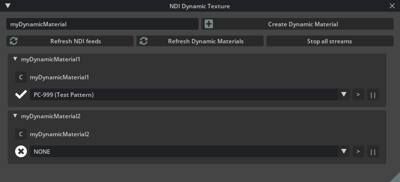

# Kit-exts-ndi

Experimenting with ndi feed in Omniverse.

## Getting started

- Requires Kit >= 104.1
- Tested in Create 2022.3.3
- Not working in Code

```
$ ./link_app.bat --app create
$ ./app/omni.create.bat --/rtx/ecoMode/enabled=false --ext-folder exts --enable fredericl.ndi.experimentation
```

Or open [example.usda](./example.usda) in Create.

## Extension window


### Header
- Text field: (“myDynamicMaterial”) the identifier for the material to create
- Create Dynamic Material: Creates a new material and shader under /Looks with the associated configuration for dynamic rendering
- Refresh NDI feeds: By default, no NDI feeds are present, you must manually seek them with this button. It will freeze the app for a few seconds while it detect NDI. Once the operation is completed, the dropdown menus will be populated with what is detected
- Refresh Dynamic materials: Searches through the stage hierarchy for any material with a dynamic asset source (like the one created by “Create Dynamic Material”). Might crash if you created a custom dynamic material without the proper configurations. Will add a collapsible section for each unique id found
- Stop all streams: stop the reception of NDI data for all materials. A material with dynamic source will display the last frame it received

### Dynamic materials
- ”C”: Copy button, to copy the value for the dynamic asset source (dynamic://myDynamicMaterial1)
- Checkmark or X icon: If the stream is alive. Might not be reliable because its not updated in real-time, only when one of the refresh buttons is clicked
- NDI feed combobox: Select which NDI feed to use for this material id. This value is saved in USD as a custom property in the shader under ndi:source
- ">" and "||" buttons:  Play/Pause the reception of NDI data

## Resources
- [kit-cv-video-example](https://github.com/jshrake-nvidia/kit-cv-video-example)
- [kit-dynamic-texture-example](https://github.com/jshrake-nvidia/kit-dynamic-texture-example)
- [ndi-python](https://github.com/buresu/ndi-python)
