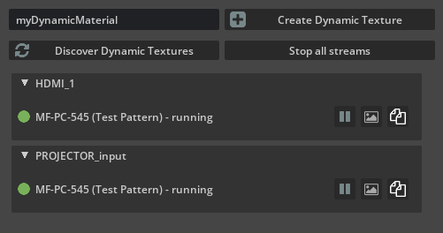

# mf.ov.ndi

An extension to enable NDI® live video input in Omniverse.

## Getting started

- Requires Omniverse Kit >= 104.1
- Tested in Create 2022.3.3, Code 2022.3.3
- Requires [NDI® 5.5.3 runtime for Windows](https://go.ndi.tv/tools-for-windows)

This plugin is using the `dynamic://` keyword which is currently a beta feature of Omniverse.

## Extension window


### Window header
- ➕**Create Dynamic Texture**: Creates a new material and shader under /Looks with the associated configuration for dynamic texture rendering. The text field `myDynamicMaterial` allows to customize the identifier for the dynamic texture to register.
- 🔄**Discover Dynamic Textures** searches through the USD stage hierarchy for any material with a `dynamic://` asset source (like the one created by “Create Dynamic Material”). Will add a collapsible section for each unique id found
- ⏹️**Stop all streams** stops the reception of the video stream for every dynamic texture. A material with a dynamic texture source will still display the last frame it received.

### Dynamic material component

Each dynamic texture will be represented in a collapsible component.
The title is the name of your dynamic texture.

- ☑️ Indicates the health of the video feed.
- **NDI® feed combobox** Select which NDI® feed to use for this dynamic texture identifier. This value is saved in USD as a custom property in the shader under `ndi:source`
- ⏸️ Allows to start/stop the video feed.
- 🖼️ Allows to switch the feed to Low bandwidth mode, saving performance by decreasing resolution for a particular feed.
- 🗇 To copy to clipboard the identifiers of the dynamic texture Example `dynamic://myDynamicMaterial`

## Application startup

```
$ ./link_app.bat --app create
$ ./app/omni.create.bat --/rtx/ecoMode/enabled=false --ext-folder exts --enable mf.ov.ndi
```

On simply search for this community extension within the Extension Window of Create

You may want to use [example.usda](./example.usda) in Create for your first test.

## Resources
- [kit-cv-video-example](https://github.com/jshrake-nvidia/kit-cv-video-example)
- [kit-dynamic-texture-example](https://github.com/jshrake-nvidia/kit-dynamic-texture-example)
- [ndi-python](https://github.com/buresu/ndi-python)

## Known issues
- Currently implemented with Python, performance could be greatly improved with C++ (but limited by DynamicTextureProvider implementation)
- You can ignore warnings in the form of `[Warning] [omni.hydra] Material parameter '...' was assigned to incompatible texture: '...'`
- You can ignore warnings in the form of `[Warning] [omni.ext._impl._internal] mf.ov.ndi-... -> <class 'mf.ov.ndi...'>: extension object is still alive, something holds a reference on it...`
